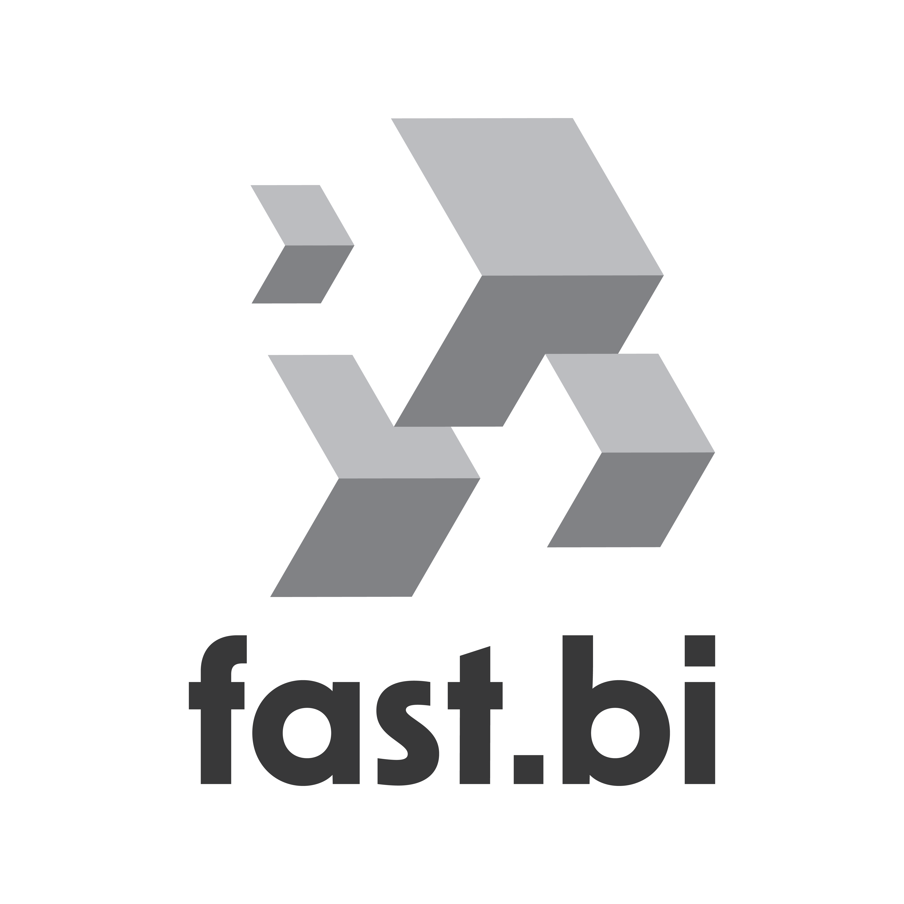
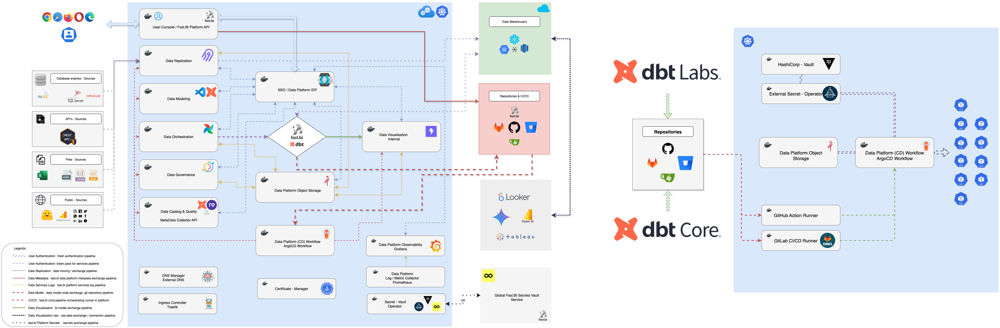

# Fast.BI

<p align="center">
  <a href="https://fast.bi">
    
  </a>
</p>

<p align="center">
  <strong>The Open-Source Data Development Platform</strong>
</p>

<p align="center">
  Fast.BI is a comprehensive data platform that unifies data replication, transformation, orchestration, governance, and visualization in a single, powerful solution. Built on proven open-source technologies with enterprise-grade automation and integration.
</p>

<div align="center">
  
  🚀 **Active Development** 🚀
  
  **Fast.BI is in very active development.** We're continuously improving and expanding the platform with new features, integrations, and cloud provider support.
  
  **We welcome contributors, feedback, and new users!** 🎯
  
</div>

<p align="center">
  <a href="https://fast.bi"><strong>Website</strong></a> •
  <a href="../../cli/README.md"><strong>Getting Started</strong></a> •
  <a href="https://wiki.fast.bi"><strong>Documentation</strong></a> •
  <a href="#community"><strong>Community</strong></a>
</p>

---

## 🚀 What is Fast.BI?

Fast.BI is an end-to-end data development platform that consolidates the entire modern data stack into a unified experience. The core idea behind Fast.BI was to create a wrapper on top of popular data services - because all these services are autonomous and don't talk to each other naturally.

Fast.BI helps connect everything: with Fast.BI backend services, these tools connect and automate all flows seamlessly. Instead of managing multiple disconnected tools, Fast.BI provides a single-page application (SPA) architecture that integrates best-in-class open-source technologies with intelligent automation and enterprise-ready features.

### Why Fast.BI?

- **🔄 Complete Data Pipeline**: From data replication to visualization in one platform
- **⚡ Rapid Deployment**: Get from zero to production-ready data pipelines in minutes, not weeks  
- **🛠️ Built on Open Source**: Leverages proven tools like Airbyte, dlthub, dbt-core(primerally), Airflow, and DataHub
- **🎯 Focus on Modeling**: Spend time on data insights, not infrastructure management
- **☁️ Cloud Agnostic**: Deploy anywhere - AWS, GCP, Azure, or on-premises (Microservices based)

## 🏗️ Architecture

Fast.BI acts as an intelligent orchestration and automation layer on top of industry-standard open-source tools:

<p align="center">
  
 </p>

| Component | Technology | Purpose |
|-----------|------------|---------|
| **Data Replication** | Airbyte/dlthub | Move data from sources to destinations |
| **Data Transformation** | dbt Core | Transform and model your data |
| **Data Quality/Tests** | Re_Data(dbt) | Set your bussines data test on data model |
| **Orchestration** | Apache Airflow | Schedule and manage workflows |
| **Governance** | DataHub | Catalog and govern your data assets |
| **Visualization** | Lightdash/Superset | Explore and visualize insights |
| **Development** | VSCode (code-server) | Browser-based data modeling IDE |

## 🎯 Who is Fast.BI for?

### Data Enthusiasts & Individual Contributors
If you're a data enthusiast who doesn't want to spend time learning DevOps to prepare and build data infrastructure, Fast.BI is exactly for you. Perfect for:
- **Data Engineers** who want to focus on data modeling instead of infrastructure management
- **Data Analysts** who need quick access to integrated data without complex setup
- **Data Scientists** who want to spend time on analysis, not on building data platforms

### Small & Medium Data Teams
When you're just starting with data, teams are usually small and handle many responsibilities. Most teams don't have extensive knowledge in Kubernetes or Docker world, so this platform helps significantly:
- Teams without dedicated DevOps resources
- Organizations needing rapid data platform deployment
- Groups focused on data insights rather than infrastructure complexity

### Enterprise & Legacy Data Teams
Most enterprises have a huge history with data, and all data is often shaped in legacy formats - old running data pipelines, cubes, etc. When enterprise teams want to start modernizing their data stack, they can start with Fast.BI:
- **Open technology** without limitations - adapt it for your needs
- **Legacy data modernization** - bridge the gap between old and new systems
- **Scalable architecture** that grows with enterprise requirements

## 📦 Products

### Fast.BI Open-Source
The complete open-source data development platform including:
- Integrated data pipeline management
- Automated dbt project initialization
- Web-based data modeling environment
- Comprehensive monitoring and observability
- Data quality and governance tools

**Repository**: [fast-bi](https://github.com/fast-bi/data-development-platform)

### Extensions

#### fast-bi-runner
A specialized Airflow package available on PyPI that provides flexible execution strategies for dbt workloads across different environments.

**Features**:
- Multiple execution operators (Kubernetes, Bash, API)
- Automated DAG generation from dbt projects
- Resource optimization and scaling
- Enhanced monitoring and alerting

**Install**: `pip install fast-bi-runner`  
**PyPI**: [fast-bi-runner and fast-bi-replication-control on PyPI](https://pypi.org/user/FastBI/)

## 🚀 Getting Started

> Quick path: Deploy on Google Cloud with our step-by-step guide → https://wiki.fast.bi/en/User-Guide/Data-Platform-Deployment/Google-Cloud

### Quick Start
```bash
# Clone the repository
git clone https://github.com/fast-bi/data-development-platform.git
cd data-development-platform

# Use python cli.py 
python cli.py --help

# Follow the interactive wizard
# Access Fast.BI at your configured domain
```

## 🖥️ Fast.BI CLI

Fast.BI provides a comprehensive command-line interface for deploying and managing the platform across multiple cloud providers.

### CLI Features

- **Multi-Cloud Support**: Deploy on GCP, AWS, Azure, or On-Premises
- **Phase-Based Deployment**: 6 controlled deployment phases
- **Interactive & Non-Interactive Modes**: Flexible deployment options
- **State Management**: Resume deployments from any phase
- **Service Tracking**: Skip already deployed services
- **Security**: Encrypted deployment files with key management

### CLI Usage

```bash
# Interactive deployment (recommended for first-time users)
python cli.py

# Non-interactive deployment using configuration file
python cli.py --config cli/deployment_configuration.yaml --non-interactive

# Deploy specific phases only
python cli.py --phase 1,2,3

# Destroy entire environment
python cli.py --destroy
```

### CLI Architecture

Fast.BI follows a clean architecture pattern with separate interfaces for different use cases:

```
                           ┌─────────────────┐
                           │   Core Logic    │
                           │  (Class Files)  │
                           └────────┬────────┘
                                   │
                    ┌──────────────┴──────────────┐
                    │                             │
             ┌──────┴──────┐               ┌──────┴──────┐
             │     CLI     │               │     API     │
             │  Interface  │               │  Interface  │
             └──────┬──────┘               └──────┬──────┘
                    │                             │
            ┌───────┴────────┐             ┌─────┴───────┐
            │  Local Usage   │             │   Frontend  │
            │(Your Laptop)   │             │(Web Browser)│
            └────────────────┘             └─────────────┘
```

**Core Logic**: Shared business logic and deployment management  
**CLI Interface**: Command-line interface for local development and deployment  
**API Interface**: REST API for web frontend and automation (future)  
**Local Usage**: Direct CLI usage on developer machines  
**Frontend**: Web-based interface for non-technical users (future)

### Deployment Phases

1. **Phase 1**: Infrastructure Deployment (GCP/AWS/Azure/On-Premises)
2. **Phase 2**: Generate Platform Secrets (Vault, Data Warehouse, Git)
3. **Phase 3**: Configure Data Platform Repositories
4. **Phase 4**: Deploy Infrastructure Services (Kubernetes services)
5. **Phase 5**: Deploy Data Services (Airbyte, dbt, Airflow, etc.)
6. **Phase 6**: Finalize Deployment (Save to Git, Generate keys)

For detailed CLI documentation, see [CLI Documentation](../../cli/README.md).

### Deployment Guides

Choose your deployment path:

- **🥇 [GCP Deployment](../../docs/gcp-deployment.md)** - **Recommended & Fully Tested**
  - Complete infrastructure automation
  - GKE cluster with managed services
  - Best for production deployments

- **🥈 [On-Premise Deployment](../../docs/onpremise-deployment.md)** - **Simple & Flexible**
  - Use your existing Kubernetes cluster
  - Just provide kubeconfig
  - Best for compliance and control

- **🥉 [Deployment Overview](../../docs/deployment-overview.md)** - **Compare all options**
  - Decision tree for choosing deployment type
  - Feature comparison matrix
  - Prerequisites and requirements

### Cloud Deployment
Fast.BI provides Terraform modules for one-click deployment on major cloud providers:

- **GCP**: Deploy on GKE with BigQuery/Snowflake/Redshift ✅ **Production Ready** [(Default)](../../docs/gcp-deployment.md)
- **AWS**: Deploy on EKS with Redshift/Snowflake/Bigquery 🚧 **80% Ready** [(In Development)](../../docs/aws-deployment.md)
- **Azure**: Deploy on AKS with Azure Synapse/BigQuery/Snowflake/Redshift 📅 **Q4 2025** [(Planned)](../../docs/azure-deployment.md)

### On-Premise Deployment
Fast.BI provides Automatic modules for one-click deployment on premise:

- **KubeConfig**: When Kubernetes cluster is ready on any technology (K3S, Talos, Tanzu..) provide kubeconfig to deploy.

### Prerequisites
- Docker and Docker Compose
- Kubernetes cluster (for production deployment)
- Cloud account (AWS/GCP/Azure) for managed services

## 📚 Documentation

### Getting Started
- **[CLI Documentation](../../cli/README.md)** - Complete CLI usage guide, prerequisites, and deployment
- **[Deployment Overview](../../docs/deployment-overview.md)** - Choose your deployment path

### Deployment Guides
- **[GCP Deployment](../../docs/gcp-deployment.md)** - Deploy on Google Cloud Platform ✅ **Production Ready**
- **[AWS Deployment](../../docs/aws-deployment.md)** - Deploy on Amazon Web Services 🚧 **80% Ready**
- **[Azure Deployment](../../docs/azure-deployment.md)** - Deploy on Microsoft Azure 📅 **Q4 2025**
- **[On-Premise Deployment](../../docs/onpremise-deployment.md)** - Deploy on your infrastructure ✅ **Ready**

### Project Information
- **[Roadmap](../../ROADMAP.md)** - Current status and future plans
- **[Contributing](../../CONTRIBUTING.md)** - How to contribute to Fast.BI
- **[Licensing](../../docs/licensing.md)** - License information

## 🤝 Community & Support

Fast.BI is a fully open-source platform with community-driven development:

- **Community Support**: GitHub discussions, issues, and community forums
- **Professional Services**: Optional implementation assistance and consulting
- **Extended Team Support**: We can help if you need additional data engineering expertise
- **Custom Development**: Tailored connectors and transformations for specific needs
- **Training & Workshops**: Team training and best practices guidance

[Contact Us](mailto:support@fast.bi) for professional services or extended team support.

### Contributing

We welcome contributions from the community! Fast.BI is built on open-source principles and thrives with community involvement.

- 🐛 **Report Issues**: Found a bug? Let us know!
- 🔧 **Submit PRs**: Improvements and fixes are always welcome
- 📖 **Improve Docs**: Help make our documentation even better
- 💡 **Feature Requests**: Share your ideas for new capabilities

See our [Contributing Guide](../../CONTRIBUTING.md) for details.

### Join the Community

Join our growing community of data practitioners:

- **GitHub Discussions**: Ask questions and share experiences
- **Documentation**: Comprehensive guides and tutorials
- **Blog**: Best practices and case studies at [fast.bi/blog](https://fast.bi/blog)

## 📄 License

Fast.BI platform code is available under the [MIT License](../../LICENSE).

See our [OSS License Overview](../../docs/licensing/) for complete details.

## 🌟 Star History

[](https://star-history.com/#fast-bi/data-development-platform&Date)

---

<p align="center">
  <strong>Ready to accelerate your data journey?</strong><br>
  <a href="https://fast.bi">Get Started with Fast.BI</a>
</p>

### Thank You

Fast.BI would not be possible without the support and assistance of other open-source tools and companies! Visit our [thank you page](../../THANK-YOU.md) to learn more about how we build Fast.BI.

<a href="https://github.com/fast-bi/data-development-platform/graphs/contributors">
  
</a>

# Fast.BI

<p align="center">
  <a href="https://fast.bi">
    
  </a>
</p>

<p align="center">
  <strong>The Open-Source Data Development Platform</strong>
</p>

<p align="center">
  Fast.BI is a comprehensive data platform that unifies data replication, transformation, orchestration, governance, and visualization in a single, powerful solution. Built on proven open-source technologies with enterprise-grade automation and integration.
</p>

<div align="center">
  
  🚀 **Active Development** 🚀
  
  **Fast.BI is in very active development.** We're continuously improving and expanding the platform with new features, integrations, and cloud provider support.
  
  **We welcome contributors, feedback, and new users!** 🎯
  
</div>

<p align="center">
  <a href="https://fast.bi"><strong>Website</strong></a> •
  <a href="cli/README.md"><strong>Getting Started</strong></a> •
  <a href="https://wiki.fast.bi"><strong>Documentation</strong></a> •
  <a href="#community"><strong>Community</strong></a>
</p>

---

## 🚀 What is Fast.BI?

Fast.BI is an end-to-end data development platform that consolidates the entire modern data stack into a unified experience. The core idea behind Fast.BI was to create a wrapper on top of popular data services - because all these services are autonomous and don't talk to each other naturally.

Fast.BI helps connect everything: with Fast.BI backend services, these tools connect and automate all flows seamlessly. Instead of managing multiple disconnected tools, Fast.BI provides a single-page application (SPA) architecture that integrates best-in-class open-source technologies with intelligent automation and enterprise-ready features.

### Why Fast.BI?

- **🔄 Complete Data Pipeline**: From data replication to visualization in one platform
- **⚡ Rapid Deployment**: Get from zero to production-ready data pipelines in minutes, not weeks  
- **🛠️ Built on Open Source**: Leverages proven tools like Airbyte, dlthub, dbt-core(primerally), Airflow, and DataHub
- **🎯 Focus on Modeling**: Spend time on data insights, not infrastructure management
- **☁️ Cloud Agnostic**: Deploy anywhere - AWS, GCP, Azure, or on-premises (Microservices based)

## 🏗️ Architecture

Fast.BI acts as an intelligent orchestration and automation layer on top of industry-standard open-source tools:

<p align="center">
  
 </p>

| Component | Technology | Purpose |
|-----------|------------|---------|
| **Data Replication** | Airbyte/dlthub | Move data from sources to destinations |
| **Data Transformation** | dbt Core | Transform and model your data |
| **Data Quality/Tests** | Re_Data(dbt) | Set your bussines data test on data model |
| **Orchestration** | Apache Airflow | Schedule and manage workflows |
| **Governance** | DataHub | Catalog and govern your data assets |
| **Visualization** | Lightdash/Superset | Explore and visualize insights |
| **Development** | VSCode (code-server) | Browser-based data modeling IDE |

## 🎯 Who is Fast.BI for?

### Data Enthusiasts & Individual Contributors
If you're a data enthusiast who doesn't want to spend time learning DevOps to prepare and build data infrastructure, Fast.BI is exactly for you. Perfect for:
- **Data Engineers** who want to focus on data modeling instead of infrastructure management
- **Data Analysts** who need quick access to integrated data without complex setup
- **Data Scientists** who want to spend time on analysis, not on building data platforms

### Small & Medium Data Teams
When you're just starting with data, teams are usually small and handle many responsibilities. Most teams don't have extensive knowledge in Kubernetes or Docker world, so this platform helps significantly:
- Teams without dedicated DevOps resources
- Organizations needing rapid data platform deployment
- Groups focused on data insights rather than infrastructure complexity

### Enterprise & Legacy Data Teams
Most enterprises have a huge history with data, and all data is often shaped in legacy formats - old running data pipelines, cubes, etc. When enterprise teams want to start modernizing their data stack, they can start with Fast.BI:
- **Open technology** without limitations - adapt it for your needs
- **Legacy data modernization** - bridge the gap between old and new systems
- **Scalable architecture** that grows with enterprise requirements

## 📦 Products

### Fast.BI Open-Source
The complete open-source data development platform including:
- Integrated data pipeline management
- Automated dbt project initialization
- Web-based data modeling environment
- Comprehensive monitoring and observability
- Data quality and governance tools

**Repository**: [fast-bi](https://github.com/fast-bi/data-development-platform)

### Extensions

#### fast-bi-runner
A specialized Airflow package available on PyPI that provides flexible execution strategies for dbt workloads across different environments.

**Features**:
- Multiple execution operators (Kubernetes, Bash, API)
- Automated DAG generation from dbt projects
- Resource optimization and scaling
- Enhanced monitoring and alerting

**Install**: `pip install fast-bi-runner`  
**PyPI**: [fast-bi-runner and fast-bi-replication-control on PyPI](https://pypi.org/user/FastBI/)

## 🚀 Getting Started

> Quick path: Deploy on Google Cloud with our step-by-step guide → https://wiki.fast.bi/en/User-Guide/Data-Platform-Deployment/Google-Cloud

### Quick Start
```bash
# Clone the repository
git clone https://github.com/fast-bi/data-development-platform.git
cd data-development-platform

# Use python cli.py 
python cli.py --help

# Follow the interactive wizard
# Access Fast.BI at your configured domain
```

## 🖥️ Fast.BI CLI

Fast.BI provides a comprehensive command-line interface for deploying and managing the platform across multiple cloud providers.

### CLI Features

- **Multi-Cloud Support**: Deploy on GCP, AWS, Azure, or On-Premises
- **Phase-Based Deployment**: 6 controlled deployment phases
- **Interactive & Non-Interactive Modes**: Flexible deployment options
- **State Management**: Resume deployments from any phase
- **Service Tracking**: Skip already deployed services
- **Security**: Encrypted deployment files with key management

### CLI Usage

```bash
# Interactive deployment (recommended for first-time users)
python cli.py

# Non-interactive deployment using configuration file
python cli.py --config cli/deployment_configuration.yaml --non-interactive

# Deploy specific phases only
python cli.py --phase 1,2,3

# Destroy entire environment
python cli.py --destroy
```

### CLI Architecture

Fast.BI follows a clean architecture pattern with separate interfaces for different use cases:

```
                           ┌─────────────────┐
                           │   Core Logic    │
                           │  (Class Files)  │
                           └────────┬────────┘
                                   │
                    ┌──────────────┴──────────────┐
                    │                             │
             ┌──────┴──────┐               ┌──────┴──────┐
             │     CLI     │               │     API     │
             │  Interface  │               │  Interface  │
             └──────┬──────┘               └──────┬──────┘
                    │                             │
            ┌───────┴────────┐             ┌─────┴───────┐
            │  Local Usage   │             │   Frontend  │
            │(Your Laptop)   │             │(Web Browser)│
            └────────────────┘             └─────────────┘
```

**Core Logic**: Shared business logic and deployment management  
**CLI Interface**: Command-line interface for local development and deployment  
**API Interface**: REST API for web frontend and automation (future)  
**Local Usage**: Direct CLI usage on developer machines  
**Frontend**: Web-based interface for non-technical users (future)

### Deployment Phases

1. **Phase 1**: Infrastructure Deployment (GCP/AWS/Azure/On-Premises)
2. **Phase 2**: Generate Platform Secrets (Vault, Data Warehouse, Git)
3. **Phase 3**: Configure Data Platform Repositories
4. **Phase 4**: Deploy Infrastructure Services (Kubernetes services)
5. **Phase 5**: Deploy Data Services (Airbyte, dbt, Airflow, etc.)
6. **Phase 6**: Finalize Deployment (Save to Git, Generate keys)

For detailed CLI documentation, see [CLI Documentation](cli/README.md).

### Deployment Guides

Choose your deployment path:

- **🥇 [GCP Deployment](docs/gcp-deployment.md)** - **Recommended & Fully Tested**
  - Complete infrastructure automation
  - GKE cluster with managed services
  - Best for production deployments

- **🥈 [On-Premise Deployment](docs/onpremise-deployment.md)** - **Simple & Flexible**
  - Use your existing Kubernetes cluster
  - Just provide kubeconfig
  - Best for compliance and control

- **🥉 [Deployment Overview](docs/deployment-overview.md)** - **Compare all options**
  - Decision tree for choosing deployment type
  - Feature comparison matrix
  - Prerequisites and requirements

### Cloud Deployment
Fast.BI provides Terraform modules for one-click deployment on major cloud providers:

- **GCP**: Deploy on GKE with BigQuery/Snowflake/Redshift ✅ **Production Ready** [(Default)](docs/gcp-deployment.md)
- **AWS**: Deploy on EKS with Redshift/Snowflake/Bigquery 🚧 **80% Ready** [(In Development)](docs/aws-deployment.md)
- **Azure**: Deploy on AKS with Azure Synapse/BigQuery/Snowflake/Redshift 📅 **Q4 2025** [(Planned)](docs/azure-deployment.md)

### On-Premise Deployment
Fast.BI provides Automatic modules for one-click deployment on premise:

- **KubeConfig**: When Kubernetes cluster is ready on any technology (K3S, Talos, Tanzu..) provide kubeconfig to deploy.

### Prerequisites
- Docker and Docker Compose
- Kubernetes cluster (for production deployment)
- Cloud account (AWS/GCP/Azure) for managed services

## 📚 Documentation

### Getting Started
- **[CLI Documentation](cli/README.md)** - Complete CLI usage guide, prerequisites, and deployment
- **[Deployment Overview](docs/deployment-overview.md)** - Choose your deployment path

### Deployment Guides
- **[GCP Deployment](docs/gcp-deployment.md)** - Deploy on Google Cloud Platform ✅ **Production Ready**
- **[AWS Deployment](docs/aws-deployment.md)** - Deploy on Amazon Web Services 🚧 **80% Ready**
- **[Azure Deployment](docs/azure-deployment.md)** - Deploy on Microsoft Azure 📅 **Q4 2025**
- **[On-Premise Deployment](docs/onpremise-deployment.md)** - Deploy on your infrastructure ✅ **Ready**

### Project Information
- **[Roadmap](ROADMAP.md)** - Current status and future plans
- **[Contributing](CONTRIBUTING.md)** - How to contribute to Fast.BI
- **[Licensing](docs/licensing.md)** - License information

## 🤝 Community & Support

Fast.BI is a fully open-source platform with community-driven development:

- **Community Support**: GitHub discussions, issues, and community forums
- **Professional Services**: Optional implementation assistance and consulting
- **Extended Team Support**: We can help if you need additional data engineering expertise
- **Custom Development**: Tailored connectors and transformations for specific needs
- **Training & Workshops**: Team training and best practices guidance

[Contact Us](mailto:support@fast.bi) for professional services or extended team support.

### Contributing

We welcome contributions from the community! Fast.BI is built on open-source principles and thrives with community involvement.

- 🐛 **Report Issues**: Found a bug? Let us know!
- 🔧 **Submit PRs**: Improvements and fixes are always welcome
- 📖 **Improve Docs**: Help make our documentation even better
- 💡 **Feature Requests**: Share your ideas for new capabilities

See our [Contributing Guide](CONTRIBUTING.md) for details.

### Join the Community

Join our growing community of data practitioners:

- **GitHub Discussions**: Ask questions and share experiences
- **Documentation**: Comprehensive guides and tutorials
- **Blog**: Best practices and case studies at [fast.bi/blog](https://fast.bi/blog)

## 📄 License

Fast.BI platform code is available under the [MIT License](LICENSE).

See our [OSS License Overview](docs/licensing/) for complete details.

## 🌟 Star History

[](https://star-history.com/#fast-bi/data-development-platform&Date)

---

<p align="center">
  <strong>Ready to accelerate your data journey?</strong><br>
  <a href="https://fast.bi">Get Started with Fast.BI</a>
</p>

### Thank You

Fast.BI would not be possible without the support and assistance of other open-source tools and companies! Visit our [thank you page](THANK-YOU.md) to learn more about how we build Fast.BI.

<a href="https://github.com/fast-bi/data-development-platform/graphs/contributors">
  
</a>


